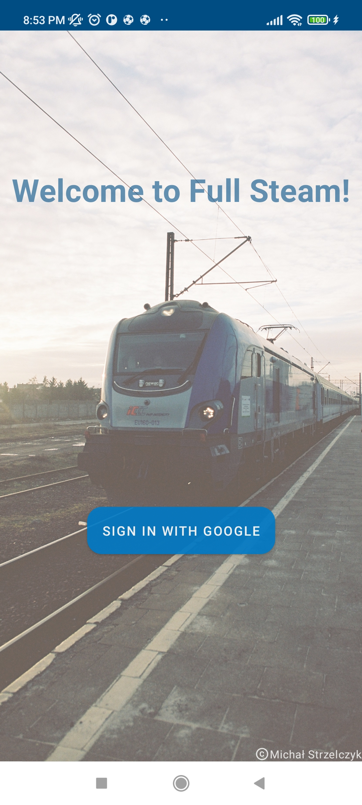
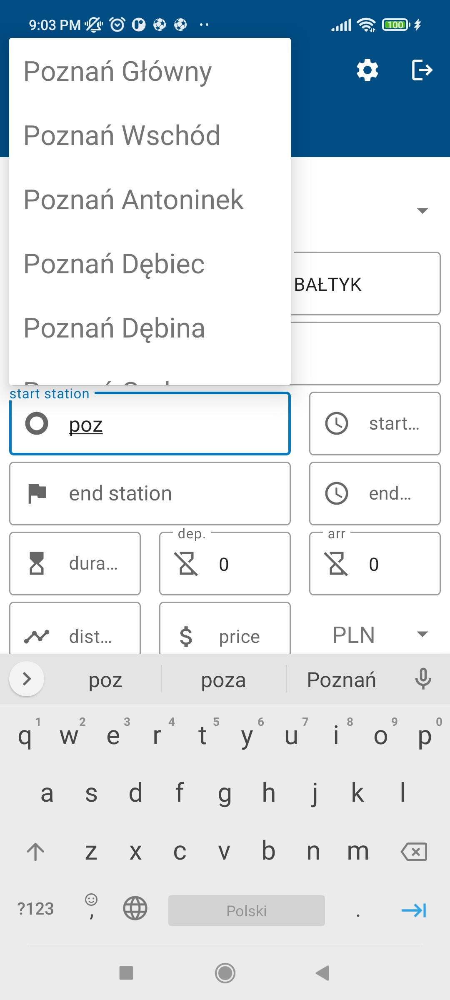
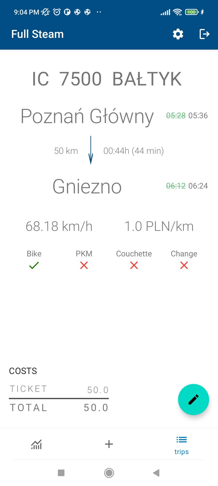
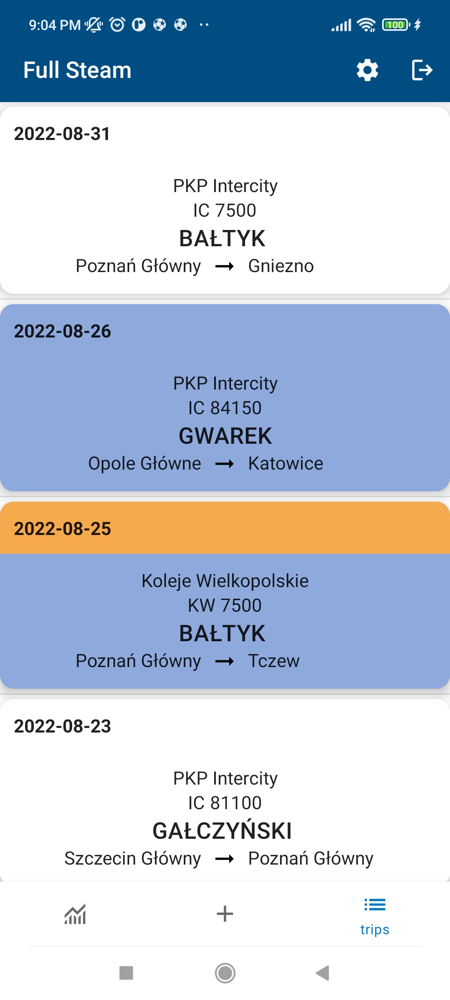

# FullSteam - *Pełną Parą*

### Overview

FullSteam was developed as a semester project on mobile applications course at Poznan University of Technology. Its main purpose is to supersede a complex spreadsheet and to shorten the time of CRUD operations. Most of the requirements were defined by my brother who travels a lot by rail. He records travel information and keeps statistics which often require manual processing such as transcription of data from the ticket (hours, distance, price, etc.). Application also allows users to add photo to each trip.

### Automation

In general, to add a trip users only need to specify trip date, train number, train name, carrier (Slider) and select start and terminal station (AutoCompleteTextView). Other information such as departure and arrival time, distance, average speed, trip duration are fetched from Koleo API. Station lists are fed with data from Portal Pasażera API in the same way as on the portalpasazera.pl portal. If price is entered, the app automatically updated price per kilometer field. Trip data is stored in Firebase Firestore Database. Pictures are stored in Firebase Storage.

### Informative interface

After consultation with the project originator, a graphical interface was created presenting as much data as possible from the original sheet. The colours of the items in the trip list indicate the delay and additional information about the service.

FullSteam was presented at a lecture on Information Technology course in the field of transport at Poznan University of Technology and it was well received.

### Dependencies

* LiveData
* ViewModel
* Glide
* Fuel
* Material 3
* Jackson
* Firebase
* Play Serivces
* Picasso
* Camera2
* Navigation
* Fragments
* RecyclerViewSwipeDecorator

### Demo

